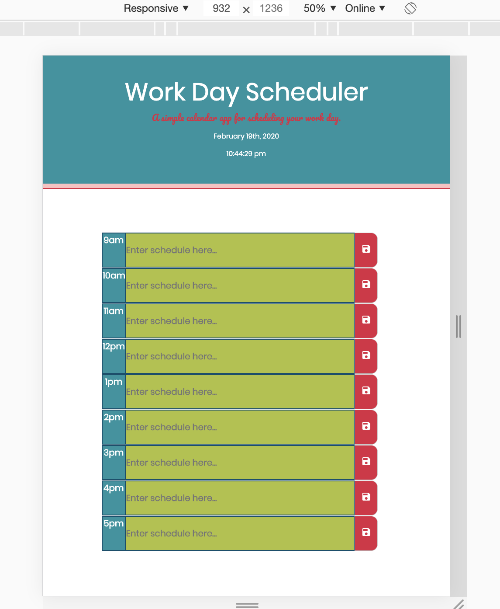

## Work Day Scheduler

## Description
The Work Day Scheduler application helps users keep track of their work day schedule.


## User Story
```
AS AN employee with a busy schedule
I WANT to add important events to a daily planner
SO THAT I can manage my time effectively
```

## Technology used in this project
* HTML
* CSS
* Javascript
* Bootstrap
* Google Fonts
* Moment.js
* Google Icons
* JQuery

## Acceptance Criteria
Open the planner, view the date displayed at the top
Business hours are displayed from 9am to 5 pm
blocks with a red background are in the past
blocks with a light grey blue background are in the present
blocks with a green background are in the future
lookover the hours
next to the hour of your choice begin to write your event, meeting, and or any reminders
press the save button to store event, meeting, and or any reminders


## Features
    -The Work Day Scheduler application has a clean and polished user interface and is responsive, ensuring that it adapts to multiple screen sizes.

    -The Work Day Scheduler application displays the date and time at the top of the calendar.

    -The Work Day Scheduler application presentes user with timeblocks for standard business hours.

    -The Work Day Scheduler application is color coded to indicate whether it is in the past, present, or future. 
    
    -The Work Day Scheduler application gives the user the ability to save events even when the user refreshs there page.

## Installation 
No installation required. Just visit the link below.

https://carlabeltran.github.io/workDayScheduler/

## Usage
Work Day Scheduler user responsive interface.



## Credits


## License


## Tests

--
Carla Beltran 2019